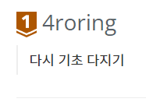

# 2021 하이브리드 잡캐 프로그래머의 회고

온갖 업무를 담당하게 되어 정신없이 사라진 2021을 돌아보자.

## 어떤 일들이 있었을까?

### 🤗 DevOps 관련 개발 중 다시 게임 관련 개발로 (게임 플랫폼 프로그래머)

아직 공개 가능한 단계의 작업은 아니지만 신작 인게임과 관련된 작업을 맡게 되면서 C++ 코드를 만지게 되었다.
엔진에서 웹서버와 통신하는 클라이언트를 개발하는 작업 진행! 웹통신, HTTP(S) 와 관련된 내용을 공부하였다.

### 🙄 갑자기 나에게 머신러닝, 딥러닝 R&D를 하라구요?

위 작업이 어느정도 정리가 되고, 당장 활용은 하지 않았기에 조금 애매한 시기.
말로만 듣던 머신러닝, 딥러닝 관련 R&D를 팀에 일부 인원이 함께 진행하게 되었다고 하여 새로 공부하게 되었다.
돈벌면서 공부는 하였는데 이래도 되나 싶었다. 책도 회사에서 다 구매해주고 정말 좋은 기회!
**배운 것을 활용하여 뭐라도 보여줄 수 있었다!!!**
기존에 알고 계시던 분과도 어쩌다보니 함께 일하게 되어 정말 신기방기.

### 🤖 신작 관련 CI도 담당하게 되었다

아니 하고있는게 이렇게 많은데 또 한가지를 담당하다니!!!
하지만 일많고 바쁜게 좋았기에 열심히 달렸다.
시작은 프로파일링 자동화 안정화, 그 외의 자동화 등 건드리게 되다보니 여기저기서 날 찾는다🤣
슬랙봇이라는 별명도 생긴뜻하다.

### 🙋‍♂️중구 난방이던 CI 개발 대통합의 신호탄을 쏘다!

사내 프로젝트는 크게는 3가지로 볼 수 있다. 관련 CI 개발자가 다 다르다.
한마디로 중구난방이다. 심지어 해당 개발자 각자의 스타일대로 시작된 작업들, 공유되지 못한 삽질들.
이 모든 노하우와 다른 분이 개발한 통합 스크립트 등 활용하여 누군가는 해야할 것 같은 것에 대한 부분을 정리.
그리고 모두 모여서 첫 논의를 시작하였다.
그렇게 대통합 시대가 시작되었고 2022년 1분기엔 마무리될 뜻 하다.

### 🛠 그렇게 위 일들을 병행하여 시간을 쏟다보니 순식간에 사라졌다.

위 내용이 1년 내내 들쑥날쑥 나에게 다가왔다. 열심히 쳐내다보니 2021이 삭제되었다😁

## 개인적으로는 이런 것을 시도해보았다!

2021년에 개인적으로 해본 것들도 아주 조금 있다.
2020 마무리하면서 한가지 프로젝트 진행해보기에 충족할 정도는 아니지만...

### [AnimeAutoDownloader](https://github.com/4roring/AnimeAutoDownloader)

rss를 이용하여 Nyaa.si 에서 특정 config 파일을 통하여 애니메이션을 다운받아주고, Flax 동기화까지 진행해주는 기능을 만들었다.
자막까지 하고 싶었지만.. 쉽지 않을 것 같더라... 조금 쓰다 Flex 앱 켜는게 귀찮아서 라프텔 결재했다더라😓

### [react-ts-tictactoe](https://4roring.github.io/react-ts-tictactoe/)

그냥 react 튜토리얼의 틱택토를 typescript로 포팅해보고 싶어서 진행한 작업.
위 링크는 github.io로 연결되고 github 주소는 [여기](https://github.com/4roring/react-ts-tictactoe).

### StockSupporter

주식을 하면서 좀 원하는 타이밍을 쉽게 잡기 위한 봇을 개발하다가 프로세스간 통신에 조금 어려움을 겪어 도중에 멈춤.
이때 DB를 쓰면 되지! 같은 생각을 못해서 그대로 멈춰버렸다. 하다 말은 프로젝트.😓

### [DevBlog](https://kwang1.tistory.com/) Tistory로 이전

입사 후 네이버 포스팅 안한지 거의 2년...? 드디어 개발 블로그를 Tistory로 이전보다는 재시작!
목표는 학원다니던 시절 작성한 Game Programming Level Up 이라는 문서를 리메이크하여 포스팅하는 것.
아직 한참 남았지만 조금씩 하다보면 끝이나겠지...?
그 외에 공부하는 것들도 시간나고 생각나고 심심할 때 정리중!!!

### 백준에 등급이 생긴 것을 보고 잠깐 달리다.

진짜 잠깐이지만... 브론즈 1까지 올렸다.. 시간나면 더 달려야지!

### 회사 관련 작업이지만 오픈소스에 한줄 Pull requests를 날려보다
특정 버전에서 특정 기능이 고장난 현상을 발견. 심심해서 집에서 디버깅해보는데 아주 심플한 문제였다.   
그래서 수정 후 Pull requests를 날렸다. 뭔가 양식이 있는 뜻한데 그냥 날렸다...    
회사에는 그냥 말아서 손배포했다.🤣

## 2022년에는 무엇을 해볼까?
하이브리드한 2021년, 다음은 프로페셔널하게 한 가지 길을 닦아야하지 않을까 싶다.

### 🥇 백준 등급 최대한 올려보자!
마음먹고 달리면 어디까지 갈 수 있을까? 궁굼하다. 

### 💻 이번에도 역시 프로젝트 한가지 이상.
21년도 처럼 심플한 것 말고 그래도 좀 토이프로젝트라고 부를 수 있을 규모로 해봐야겠다.

### 💪 오픈소스 기여할만한 것도 찾아보자.
첫 Pull requests 가 있었다면(적용은 안된거 같지만...) 지속적으로 또 기여할만한 프로젝트가 없는지 찾아보자!

### 📜 개발 블로그 포스팅도 지속 진행!
이왕이면 C++ 기본기 부분을 마무리 후 Win32 활용 2D 게임 개발까지는 끝내보자!   
ML/DL 관련 공부한 내용도 잘 정리해보고!!!
CI도 열심히 했으니 팁들을 정리 해보자.

22년이 시작 되고 작성한 회고, github 페이지에 첫 작성한 회고!    
앞으로도 회고를 여기에 작성할까 합니다. 심플한 깃헙 페이지!   
많은 것을 해본 21년이었고 22년에도 더더욱 성장했으면 합니다!   
쓰다보니 기록이 많이 부족하지 않았나 싶을 정도로 덜 담은거 같아요...  
이번 해는 기록도 열심히 해야겠습니다.
읽어주셔서 감사합니다!🙏
