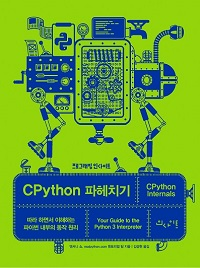
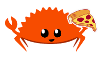
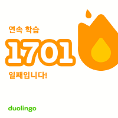
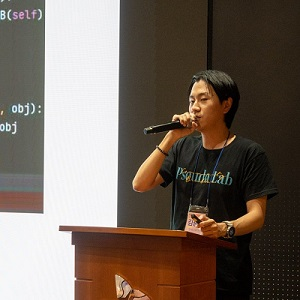
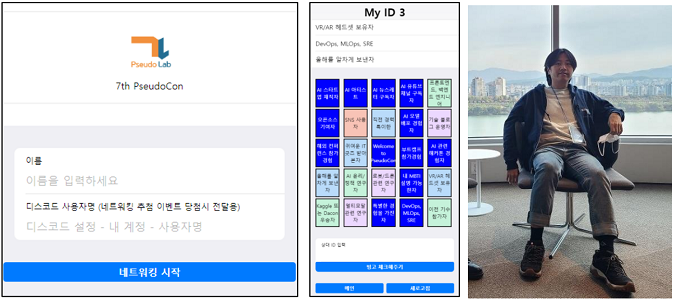

# 알차지만 속은 조금 비어보이는 2023 개발자 회고

2023년 5년차에 진입하게된 회사생활 시작 이후로 가장 알차게 보낸 한해를 돌아봅니다.

## ✅ 작년 회고에 작성한 해보고 싶은 것들 중 이거는 진행했다!

가짜연구소 빌더 (스터디, 운영진)으로 6기 CPython 파헤치기, 7기 Rust 기초 스터디를 진행 및 PseudoCon 행사 운영에 참여

### 가짜연구소 6기 빌더 CPython 파헤치기

현재 주로 업무에서 사용하는 언어가 Python이기 때문에 인터프리터의 기반이 되는 코드를 보면 조금 더 잘 사용할 수 있지 않을까라는 생각과 함께 책을 먼저 가지고 있었고 혼자서는 도저히 진행하지 않아 가짜연구소에서 스터디를 개설하여 진행.  
스터디원들과 각자 사용하는 Python 개발 관련 이야기도 많이 나눌 수 있었고 함께 공부하면서 서로 이해한 것도 나누면서 여러가지로 Python과 많이 가까워질 수 있었던 스터디.

### 가짜연구소 7기 빌더 cheese-cRust (Rust 기초)

어쩌다 Rust라는 프로그래밍 언어에 대한 글을 보게 되었는데 코드를 작성하는 방식 이나 성능 등에 매우 흥미를 느꼈고 재미로 시작해보고 싶어 스터디를 개설하여 진행.  
Rust에 흥미를 가진 스터디원들과 함께 공부하고 이때 나오는 다양한 언어에 존재하는 특성과 Rust만의 특성, 다른 언어와 비교하면서 이야기를 나눌 수 있어 Rust 하나만 공부했다기보다는 다방면으로 스쳐가듯 공부할 수 있었던 스터디.

---

## ❌ 해보고 싶다고 작성하고 하지 않은 것

영어공부.. 여전히 듀오링고 출석체크는 열심히 하는중...  
하지만 막연하게 하고싶다이고 목표가 없는 상태.  
듀오링고가 의미가 있냐면 아주 조금있음.

그 외에 프로젝트 두 가지정도 작성했었는데 하나도 하지 않음...

---

## 🙄 어떤 일들이 있었을까?

> 키워드 요약: 다양한 활동, 내실 다지기

### 가짜 연구소 빌더 (운영진) 활동

위에 작성한 것과 같이 6기 CPython, 7기 Rust 스터디를 운영.

**6th PseudoCon**에서 `파이썬의 비밀: 그 안에는 어떤 마법이 있을까?` 라는 제목으로 CPython 파헤치기에서 공부한 내용을 요약하여 발표를 진행  
네트워킹 부스를 담당하여 많은 개발자 및 개발 지망생들의 대화의 장을 만들어주는 역할도 담당

**7th PseudoCon**에서 연속으로 네트워킹 부스를 담당  
행사 기획하시는 분이 아이디어를 내주셔서 약 5일간 행사용 Bingo 웹페이지를 개발  
svelte-kit과 python fastapi를 사용하여 개발하였고 빌드 및 배포는 같이 담당하는 분이 git action과 oracle cloud를 활용하여 진행  
내가 고른 3가지 나의 특성을 상대에게 줘서 빙고를 채울 수 있는 방식으로 네트워킹에서 쉽게 대화를 시작할 수 있는 환경 제공에 성과를 낼 수 있었음
